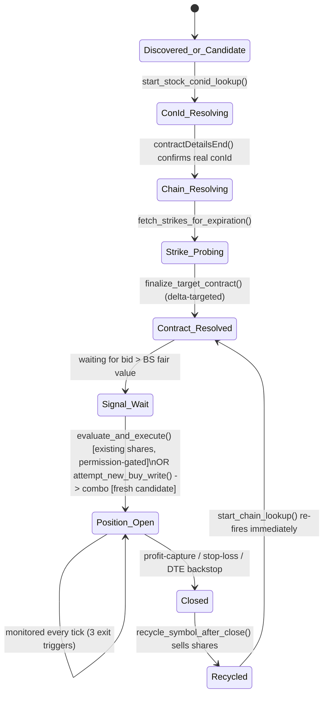

# Buy-Write (Covered Call) Basket Engine — Technical Documentation

**Audience:** a software engineer picking up this codebase for the first
time — not a trading/options primer, but you should know what a covered
call and a delta are before this will make sense.

**Scope:** this document describes the single-file engine
(`BuyWriteBasketEngine`, subclassing `ibapi`'s `EWrapper` + `EClient`)
that connects to Interactive Brokers TWS/Gateway, discovers existing
positions, and autonomously opens/monitors/closes covered-call
("buy-write") positions on a fixed universe of symbols (currently the
"Magnificent Seven": AAPL, MSFT, GOOGL, AMZN, META, NVDA, TSLA).

---

## 1. Summary

The engine's job, every trading day, is:

1. Connect to TWS/Gateway (`127.0.0.1:7497`, `clientId=8157` — the
   default paper-trading port).
2. Discover whatever the broker currently shows in the account: long
   shares, short calls, open orders.
3. For every candidate symbol not currently held, resolve a
   delta-targeted call ~30 days out and watch for it to look
   "mispriced" (bid above the engine's own Black-Scholes fair value).
4. When a signal fires, deploy available cash into a **buy-write combo**
   (buy 100 shares, sell 1 call, one atomic order) — this is
   deliberately the *only* way this account can currently write a
   covered call (see §7).
5. Monitor every open call against three independent exit rules:
   profit-capture, stop-loss, and a DTE ("days to expiration")
   backstop.
6. On close, sell the shares and reset the symbol so it's eligible for
   a fresh buy-write.
7. On every reconciliation pass, defensively catch and correct for
   things IB itself does that the engine doesn't originate — early/
   partial assignment, options expiring, and (as of the latest fix)
   **shares that are held with no call on them at all**.

There is no forced end-of-day flatten. Positions are meant to be held
across restarts (including a routine "shut it down when markets
close, start it up again next morning" cadence) — see §13.

---

## 2. Runtime Requirements & How to Run

- Python 3, `ibapi` (Interactive Brokers' official API package).
- TWS or IB Gateway running and listening on `127.0.0.1:7497` (paper
  trading port by default; live trading uses `7496`), with API access
  enabled and `clientId=8157` free.
- Windows-style hardcoded file paths (see §12) — this script currently
  assumes it's running on a machine with a `C:\Users\Brandon.R\` home
  directory. **Portability note:** these should become configurable
  (env var or CLI arg) before running on any other machine.
- Entry point is the bottom of the file: instantiate, `connect()`,
  `run()` (which blocks — this is `ibapi`'s own event loop, driven by a
  background reader thread that invokes the `EWrapper` callbacks below).
- No CLI arguments, no config file — every knob is a module-level
  constant (see §5) or an `__init__` instance attribute.

---

## 3. High-Level Architecture

- **Callback-driven, not request/response.** This class mixes in both
  `EWrapper` (IB pushes callbacks into it — `tickPrice`, `positionEnd`,
  `orderStatus`, etc.) and `EClient` (the engine calls out —
  `reqMktData`, `placeOrder`, etc.). There is no synchronous "place
  order and get a result back" — every action's outcome arrives later,
  asynchronously, in a different callback, often on a different thread
  (ibapi runs a reader thread that invokes these callbacks; `placeOrder`
  itself is called from the heartbeat timer thread — see §14).
- **One heartbeat loop.** `check_market_clock()` re-arms itself via
  `threading.Timer(1.0, ...)` every second. This is the *only* clock in
  the system — there's no asyncio, no separate scheduler.
- **Delayed market data.** `nextValidId()` calls
  `self.reqMarketDataType(3)` — mode **3 is delayed data**, not live.
  (`{1: LIVE, 2: FROZEN, 3: DELAYED, 4: DELAYED FROZEN}` — see
  `marketDataType()`.) This is presumably deliberate for a paper
  account, but it means every price/greek this engine acts on is
  delayed, and `tickOptionComputation` (which is where `implied_vol`
  gets populated) may fire less reliably than on a live/real-time feed
  — see `FALLBACK_VOL` in §5.
- **One `SymbolState` per ticker**, held in `self.symbol_states: dict[str, SymbolState]`.
  This is the central mutable state object everything else revolves
  around.

---

## 4. Core Data Model

### `SymbolState` (one per candidate/held symbol)

| Field | Meaning |
|---|---|
| `is_existing_holding` | `True` once the engine considers this symbol "occupied" (has shares and/or a call). Gates entry into `evaluate_new_position_opportunities()` — see §6. |
| `shares_owned` | Broker-truth share count, synced from `reqPositions()` each pass. |
| `target_option` | The **primary** short-call `Contract`, once resolved. |
| `other_option_legs` | List of `OptionLeg` — any *additional* short calls IB reports beyond the primary (handles the case of pre-existing multi-leg positions discovered at startup). |
| `contract_resolved` | `True` once a specific strike/expiry has been picked (via delta targeting, §6.2). |
| `has_executed` | Guards against writing a second standalone call on the same holding (see §7 — in practice this rarely gets set `True` under the current permission gate). |
| `position_active` | `True` while the **primary** call is open. |
| `entry_credit` / `take_profit_target` / `stop_loss_target` | Set once, at open, from the fill price. |
| `entry_days_to_expiry` | The **true, original** DTE the position had when opened — the fixed reference point for the DTE backstop. Persisted across restarts (§13). |
| `bs_edge`, `annualized_yield` | Recomputed every `evaluate_new_position_opportunities()` pass; ranking metrics only. |
| `permission_warned` | Suppresses repeat log spam for the Code-201 permission gate (§7). |

### `OptionLeg` (any short call beyond the primary, on the same symbol)

Same shape as the relevant subset of `SymbolState` fields
(`entry_credit`, `take_profit_target`, `stop_loss_target`,
`entry_days_to_expiry`, `position_active`, live bid/ask), tracked
independently so a symbol with two pre-existing short calls (different
strikes/expiries) gets both monitored on their own exit schedules.

---

## 5. Strategy Configuration Reference

All module-level constants:

| Constant | Value | Meaning |
|---|---|---|
| `TARGET_DTE_DAYS` | 30 | New positions target an expiration ~30 calendar days out (closest real listed date). |
| `TARGET_DELTA` | 0.25 | Strike selection solves analytically for the strike whose BS delta ≈ 0.25 (see §6.2), not a flat OTM %. |
| `DTE_BACKSTOP_PCT` | 0.20 | Force-close once remaining DTE ≤ 20% of the position's *entry* DTE (~6 days on a 30-day entry), regardless of P&L. |
| `PROFIT_CAPTURE_PCT` | 0.80 | Close once 80% of max possible option profit has decayed away. Derives `self.take_profit_pct = 1 - PROFIT_CAPTURE_PCT` in `__init__`. |
| `stop_loss_multiple` (instance attr, `2.0`) | — | Close if the option's value grows to 2× the entry credit. |
| `MIN_SHARES_FOR_COVER` | 100 | A position needs ≥1 full lot to get a call written against it. |
| `FALLBACK_VOL` | 0.22 | Used for Black-Scholes pricing whenever `tickOptionComputation` hasn't yet delivered a usable `impliedVol` (real risk under delayed data — see §3). |
| `STANDALONE_COVERED_CALL_PERMISSION_GRANTED` | `False` | See §7 — the single most consequential flag in the file. |
| `MIN_CASH_BUFFER` | 0.0 | Floor for both cash and IB's `ExcessLiquidity`; breaching either triggers `enforce_cash_solvency()` (§10). |
| `CANDIDATE_UNIVERSE` | Mag7 | The only symbols ever considered for a *new* position. Existing holdings outside this list are still monitored/reconciled if discovered. |
| risk-free rate | `0.05`, hardcoded inline at each Black-Scholes call site | **Not** a named constant — appears 3 separate times (`evaluate_and_execute`, `evaluate_new_position_opportunities`, `finalize_target_contract`). Minor tech debt: should be hoisted to a constant. |

---

## 6. Symbol Lifecycle



### 6.1 Discovery vs. candidate scanning

On the **first** `positionEnd()` after connecting:

1. Every symbol with real shares (`reqPositions()`) becomes a
   `SymbolState(is_existing_holding=True)`.
2. Every symbol with a real short call gets `target_option` set from
   the *first* discovered call (the "primary"); any additional calls on
   the same symbol become `OptionLeg`s (§4).
3. `entry_days_to_expiry` for a discovered position is recovered from
   the persisted **entry-DTE ledger** if this exact contract (`conId`)
   is in it; otherwise today's remaining DTE is used as a one-time
   approximation and immediately recorded (§13).
4. Any symbol still unresolved gets `start_stock_conid_lookup()` fired.
5. `scan_candidate_universe()` then adds a fresh `SymbolState` for every
   Mag7 symbol *not already discovered* — so an existing holding and a
   Mag7 candidate never collide; discovery always wins.

### 6.2 Contract resolution (conId → chain → delta-targeted strike)

This is a strict **three-step chain**, and the ordering is load-bearing
(getting it wrong previously caused real Code-321 "Invalid contract id"
errors — see `start_chain_lookup()`'s own guard clause, which now
refuses to fire with `conId=0`):

1. `start_stock_conid_lookup()` → `reqContractDetails()` on the STK →
   `contractDetailsEnd()` confirms a real `conId` came back → **only
   then** calls `start_chain_lookup()`.
2. `start_chain_lookup()` → `reqSecDefOptParams()` → picks whichever
   real listed expiration is closest to `TARGET_DTE_DAYS` →
   `fetch_strikes_for_expiration()` → `reqContractDetails()` for the
   OPT chain at that one expiration.
3. `contractDetailsEnd()` (chain branch) picks the **middle strike** of
   the chain as a cheap "probe" contract and subscribes to its market
   data. Once `tickOptionComputation()` delivers a live `impliedVol` and
   `undPrice`, `finalize_target_contract()` runs
   `solve_strike_for_target_delta()` (closed-form, using
   `NormalDist().inv_cdf`) to find the *analytical* strike for
   `TARGET_DELTA`, then snaps to the closest **real, listed OTM
   strike** in the already-fetched chain. If vol isn't usable, it falls
   back to a flat 2%-OTM heuristic so the engine never stalls.

### 6.3 Two separate entry paths (important)

- **`evaluate_and_execute()`** — for an **existing holding** with bare
  shares and no call. Writes a **standalone** sell-to-open. **Currently
  always blocked** (§7).
- **`attempt_new_buy_write()` → `trigger_buy_write_combo()`** — for a
  **fresh candidate** with no shares at all. Buys shares + sells the
  call in one atomic `BAG` combo order. **This is the only path that
  currently works** on this account.

A bare-share holding can *only* ever get a call by first being sold off
and re-entering as a fresh candidate through the combo path — it cannot
get a call written directly on the shares it already has. This is the
crux of §7 and §8.

### 6.4 Monitoring & exit (three independent triggers)

`monitor_exit_targets()` (primary leg) / `monitor_leg_exit_targets()`
(additional legs) run on every relevant `tickPrice()` and check, in
this order:

1. **DTE backstop** — `live_dte <= entry_days_to_expiry * DTE_BACKSTOP_PCT`
   → force-close regardless of P&L.
2. **Profit capture** — `live_ask <= take_profit_target`.
3. **Stop loss** — `live_ask >= stop_loss_target`.

Whichever fires first wins; there's no priority beyond check order (DTE
backstop is checked first and returns early, so it always wins ties).

### 6.5 Recycle

`recycle_symbol_after_close()` (only reachable via
`maybe_recycle_if_fully_closed()`, which requires **both** the primary
leg and every additional leg to be inactive):

1. Sells any remaining shares (`trigger_liquidate_shares()`).
2. Tears down the market-data subscription for the now-dead contract.
3. Resets essentially the entire `SymbolState` back to "fresh
   candidate" shape (`is_existing_holding=False`, `contract_resolved=False`,
   `target_option=None`, `permission_warned=False`, etc.).
4. Immediately re-fires `start_chain_lookup()` — since `stock_conid` is
   still known, this skips straight past conId resolution. This is
   what makes rotation pick a **genuinely fresh** strike/expiration off
   the *current* price/vol, rather than reusing the stale contract from
   the position that just closed.
5. **Guard:** if `sym` is already in `liquidation_pending_symbols`
   (§9), this function returns immediately without re-submitting a sell
   or re-firing the chain lookup — this is an idempotency guard against
   being invoked twice in quick succession for the same close event.

---

## 7. The Standalone-Write Permission Gate (why bare shares exist at all)

`STANDALONE_COVERED_CALL_PERMISSION_GRANTED = False` reflects a real
account limitation: IB rejects a standalone sell-to-open call with
**Code 201** on this account's current options-trading-permission tier,
while a combo (`BAG`) buy-write order — buying stock and selling the
call as one ticket — fills fine, because IB evaluates the two order
shapes under **different permission buckets**.

Consequence: **any symbol that ends up holding shares with no call on
them cannot get one written directly.** `evaluate_and_execute()` will
find a perfectly good signal, hit this gate, log it once
(`permission_warned`), and give up on a standalone write for that
symbol for the rest of the session. This happens for two real,
recurring reasons — not a corner case:

1. A pre-existing holding discovered at startup with no call attached.
2. Any time bare shares exist for *any* other reason (partial
   fills, manual intervention, an assignment that only ate the option
   leg, etc.).

**This is exactly the gap §8 exists to close.** Historically, a bare
share position combined with `is_existing_holding=True` (which *also*
excludes the symbol from `evaluate_new_position_opportunities()`) meant
the shares were locked out of both directions — no call could be
written on them, and they could never be sold to redeploy into a fresh
combo either. They'd sit stuck indefinitely.

---

## 8. The Reconciliation Pass (`positionEnd()`, non-initial branch)

Runs once per heartbeat (~every 60 seconds — see §14), fed by
`request_position_snapshot()` → `reqPositions()` → `position()` →
`positionEnd()`.

### 8.1 What it's for

- **Assignment/expiration detection.** Compares broker-reported option
  quantity against what the engine expects. Any shrinkage (full or
  partial — **treated identically, by explicit design decision**) is
  simply synced down; there is deliberately **no halt** on this path
  (contrast with the account-wide risk halt in §11). Freed cash from an
  assigned portion needs no special handling — it already arrives via
  the live `accountSummary()` feed and gets picked up by
  `available_cash_for_new_trades()` on the next pass.
- **Bare-share recycling (the fix).** The loop's entry condition:

```python
has_active_other_legs = any(leg.position_active for leg in state.other_option_legs)
has_option_coverage = state.position_active or has_active_other_legs
liquidation_already_in_flight = sym in self.liquidation_pending_symbols
is_bare_share_holding = (
    (not has_option_coverage) and actual_shares > 0 and not liquidation_already_in_flight
)

if not has_option_coverage and not is_bare_share_holding:
    continue
```

  The **old** guard (`if not state.position_active and not
  state.other_option_legs: continue`) skipped any symbol with zero
  active option coverage — which included bare shares. That made bare
  shares invisible to `maybe_recycle_if_fully_closed()`, the only
  function that ever sells them. The new condition still processes
  every symbol with real coverage exactly as before, but now **also**
  reaches a symbol with real broker-reported shares and zero coverage,
  purely so it falls through to `maybe_recycle_if_fully_closed()` at
  the bottom of the loop.

### 8.2 Triple guard against duplicate liquidation

Because callbacks can race and this loop reruns every ~60 seconds,
there are **three independent checks** preventing a duplicate sell
order for the same bare-share symbol:

1. `is_bare_share_holding` itself excludes anything already in
   `liquidation_pending_symbols`.
2. The loop's final call site also checks:
   `if not (sym in self.liquidation_pending_symbols): self.maybe_recycle_if_fully_closed(sym)`.
3. `recycle_symbol_after_close()` itself checks the same set and
   returns early if a sale is already working.

This redundancy is deliberate defense-in-depth, not a mistake to clean
up — each guard covers a slightly different call path into the same
function.

---

## 9. Orphaned-Share Safety Net

**Problem this solves:** `trigger_liquidate_shares()` submits a plain
`MKT` sell order. IB generally will not execute a `MKT` order **outside
regular trading hours** — it just queues until the next session. If a
recycle event fires after hours (or any other rejection occurs), the
sell would previously *appear* to have happened (old code zeroed
`shares_owned` at submission time) while the broker still held the
real shares.

**Fix, in two parts:**

1. `shares_owned` is **only** cleared in `orderStatus()` on a confirmed
   `"Filled"` status for a `LIQUIDATE_SHARES` order — never
   optimistically at submission time.
2. Two tracking sets:
   - `liquidation_needed_symbols` — added the *first* time
     `trigger_liquidate_shares()` is ever called for a symbol; removed
     only once the broker confirms **zero** shares remain.
   - `liquidation_pending_symbols` — added on submit, removed on a
     confirmed fill **or** on `Cancelled`/`ApiCancelled`/`Inactive`
     (`orderStatus`) **or** an outright rejection (`error()`).

`sweep_orphaned_shares()` runs at the end of **every**
`positionEnd()` pass:

```python
for sym in list(self.liquidation_needed_symbols):
    actual_shares = self._discovered_shares.get(sym, 0)
    if actual_shares <= 0:
        self.liquidation_needed_symbols.discard(sym)   # broker confirms done
        continue
    if sym in self.liquidation_pending_symbols:
        continue   # an order is already working — give it time
    # ...resubmit trigger_liquidate_shares(sym, actual_shares)...
```

**Important scoping property:** this only ever acts on a symbol the
engine *itself* already decided needed full liquidation. It will never
spontaneously start selling some unrelated position just because it
currently lacks a call — it has no opinion about symbols outside
`liquidation_needed_symbols`.

---

## 10. Cash & Solvency Management

### 10.1 The reservation lifecycle

`available_cash_for_new_trades()` is the single source of truth every
sizing decision goes through:

```python
reserved = sum(self.pending_order_cash.values()) + self._cash_earmarked_this_pass
return self.current_cash - reserved
```

- `pending_order_cash[order_id]` — reserved the **instant** a buy-write
  combo is submitted (`trigger_buy_write_combo()`), estimated from
  `live_stock_price - live_option_bid`. Persists **across heartbeats**
  — this is what stops a slow-filling combo from being invisible to the
  next heartbeat's sizing pass.
- `_cash_earmarked_this_pass` — a lighter-weight reservation for orders
  placed *earlier in the same* `evaluate_new_position_opportunities()`
  pass, cleared at the start of each pass.

### 10.2 The OPEN_COMBO phantom-reservation fix

**Problem:** `execDetails()` is the only place that normally frees a
combo's `pending_order_cash` entry, and it only does so once
`combo_leg_fills[order_id]`'s per-leg tally (`stk_shares_filled` /
`opt_contracts_filled`) independently reaches the full expected size.
IB does not always reliably tag combo (`BAG`) execution reports with a
clean per-leg `secType` breakdown — when it doesn't, that tally never
completes, `execDetails()` never pops the reservation, and the dollar
amount stays "reserved" **forever**, even though the position is
entirely real (already reflected in `committed_capital`, `shares_owned`,
and the broker's own position records).

**Fix** — a new branch in `orderStatus()`:

```python
elif intent == "OPEN_COMBO":
    if remaining == 0:
        freed = self.pending_order_cash.pop(orderId, None)
        # ...log only...
```

IB's own order-level `status == "Filled"` with `remaining == 0` is
authoritative for "this whole order, combo included, is entirely done"
— it doesn't depend on how the fill got split into per-leg execution
reports, so it can't get stuck the way `execDetails()`'s tally can.
**Critically, this branch only releases the reservation** — it does
**not** duplicate any of `execDetails()`'s own bookkeeping (cash
netting, `committed_capital`, `shares_owned`, `entry_credit`, DTE
ledger). If `execDetails()` already handled all of that correctly,
this is a pure no-op (the reservation is already gone). It exists
purely as a backstop against a permanently stuck reservation silently
shrinking `available_cash_for_new_trades()` for the rest of the
session.

### 10.3 Account-wide solvency (`enforce_cash_solvency`)

Checked on **every** `accountSummary()` push **and** every heartbeat
tick (i.e., every second — see §14). If `current_cash` or IB's own
`ExcessLiquidity` drops below `MIN_CASH_BUFFER`:

1. Sets `cash_solvency_halt = True` (blocks all new positions).
2. Cancels every still-working buy-write order.
3. Calls `close_largest_position_for_solvency()` — picks the single
   largest open position (by estimated market value) and closes it.
   Only **one** position per call; re-runs on the next tick/summary
   push and will close another if still insolvent.

Self-clears (`cash_solvency_halt = False`) the moment both figures are
back above the floor — this flag is **continuously re-evaluated**, in
contrast to `system_halted` (§11).

---

## 11. Two Different "Halt" Flags — Don't Confuse Them

| | `system_halted` | `cash_solvency_halt` |
|---|---|---|
| Set by | `check_global_account_risk()` — daily drawdown (−8%) or markup (+15%) on **whole-portfolio** `NetLiquidation` | `enforce_cash_solvency()` — negative cash or `ExcessLiquidity` |
| Checked | Only re-evaluated **reactively**, from inside `monitor_exit_targets()` / `monitor_leg_exit_targets()` — i.e. only right after a position *closes* | Continuously — every heartbeat tick (1s) and every `accountSummary()` push |
| Self-clears? | **No** — never reset anywhere in the file. Only a process restart clears it. | **Yes** — clears automatically once solvent again |
| Effect on `tickPrice()` / `tickOptionComputation()` | **Both gated at the top** — `if price <= 0 or self.system_halted: return`. Once tripped, **all live monitoring stops**, including profit-capture/stop-loss/DTE-backstop on already-open positions. | Not checked in `tickPrice`/`tickOptionComputation` at all — only blocks `evaluate_new_position_opportunities()`. Existing positions keep being monitored normally. |
| Effect on reconciliation (`positionEnd`) | **Not checked** — assignment detection, share-count sync, and bare-share recycling all keep running regardless. | Same — unaffected. |

**Risk worth flagging explicitly:** because `check_global_account_risk()`
is only invoked from a position-close event, a drawdown that develops
purely from unrealized mark-to-market movement (no position actually
closing) will **not** trip `system_halted` until *something* closes.
And once it *does* trip, every currently-open position becomes
effectively unmanaged for the rest of the session, because `tickPrice`
stops processing entirely — they will not hit profit-capture, stop-loss,
or DTE-backstop until the process is restarted.

---

## 12. Persistence — Files on Disk

| Path (hardcoded) | Format | Written by | Read by | Purpose |
|---|---|---|---|---|
| `trade_log.txt` | Append-only timestamped text | `write_to_notepad()`, called throughout | (human/log review only) | Freeform audit trail. Grows unbounded — no rotation. |
| `engine_session_history.json` | JSON list of daily summary dicts | `save_session_history()` / `append_todays_session()` (at `shutdown_engine()`) | `load_session_history()` (at startup, for lifetime win-rate stats) | One entry per session/day. |
| `entry_dte_ledger.json` | JSON dict, keyed by option `conId` (string) | `record_entry_dte()` / `save_entry_dte_ledger()` | `load_entry_dte_ledger()` (at startup) | See §13. Entries removed via `pop_entry_dte()` once a position closes. |

**Portability note:** all three paths are hardcoded to
`C:\Users\Brandon.R\...`. Any deployment to another machine needs these
externalized (env vars, config file, or CLI args) before it will even
start correctly.

---

## 13. Entry-DTE Ledger & the DTE Backstop

The DTE backstop (§6.4, §5) needs a **fixed reference point** —
`entry_days_to_expiry` — that must **not** drift if the process
restarts mid-position. Without persistence, a routine restart (e.g.
shutting the script down every night when markets close, which this
engine is explicitly designed to support — there's no forced EOD
flatten) would make `positionEnd()` treat a still-open position as
newly "discovered," resetting its reference DTE to whatever's left
*that day* — silently moving the backstop's trip point every time the
process restarts.

Fix: `record_entry_dte(conId, dte)` writes to
`entry_dte_ledger.json` the instant a position is **actually** opened
(`execDetails()` for combos, `orderStatus()` for the standalone path).
On any later `positionEnd()` discovery of that same `conId`, the ledger
is checked **first**, before falling back to "whatever DTE is left
today" (which only happens once per contract, ever — and immediately
gets recorded so it's stable from then on). `pop_entry_dte()` removes
the entry the moment that leg closes (`trigger_close_covered_call_payload()`
/ `trigger_close_leg_payload()`), so the file never grows unbounded.

---

## 14. Threading Model & Timing

There is exactly one recurring clock: `check_market_clock()`,
re-armed via `threading.Timer(1.0, self.check_market_clock).start()`.

| Cadence | What runs |
|---|---|
| Every call (~1s) | `enforce_cash_solvency()`; shutdown check (`now.hour >= 16`) |
| Every 60th call (~60s) | Heartbeat log line; `request_position_snapshot()` (→ triggers the full `positionEnd()` reconciliation pass, §8, §9); `evaluate_new_position_opportunities()` |
| Event-driven (no fixed cadence) | Everything hanging off `tickPrice()` / `tickOptionComputation()` — i.e. exit-target monitoring and new-holding signal evaluation, which fire whenever IB pushes a new delayed quote |

`ibapi`'s reader thread invokes all `EWrapper` callbacks
(`tickPrice`, `positionEnd`, `orderStatus`, etc.) — the
`threading.Timer` heartbeat runs on its own thread. There's no explicit
locking anywhere in this file; correctness currently relies on CPython's
GIL plus the fact that individual dict/attribute mutations here are
effectively atomic. This is worth keeping in mind if any future change
introduces a multi-step read-modify-write across these threads.

---

## 15. IB API Callback Reference

| Callback | Role in this engine |
|---|---|
| `nextValidId` | Startup entry point — kicks off account summary, position snapshot, order reconciliation, and the heartbeat loop. |
| `error` | Central error sink. Frees `pending_order_cash` and `liquidation_pending_symbols` reservations on order-level errors; special-cased logging for Code 201 (permission) and 321 (bad contract id). |
| `accountSummary` / `accountSummaryEnd` | Live feed for `NetLiquidation`, `TotalCashValue`, `ExcessLiquidity`. Re-runs `enforce_cash_solvency()` on every push. |
| `position` / `positionEnd` | The reconciliation engine — see §8. |
| `openOrder` / `openOrderEnd` | Restart recovery: rebuilds `order_intents`/`order_symbol`/`combo_leg_fills` for anything still working from a prior process instance; also seeds `liquidation_needed_symbols`/`liquidation_pending_symbols` for a recovered in-flight liquidation. |
| `contractDetails` / `contractDetailsEnd` | Two distinct roles depending on which request map the `reqId` is in — stock conId resolution vs. option chain population (§6.2). |
| `securityDefinitionOptionParameter(End)` | Expiration discovery for a symbol's option chain. |
| `tickPrice` / `tickOptionComputation` | Live (delayed) quote feed — drives both signal evaluation and exit monitoring. Gated by `system_halted` (§11). |
| `execDetails` | Per-leg fill accumulation for combo orders; finalizes a new position once both legs are fully filled. |
| `orderStatus` | Fill/cancel/reject handling for every order type this engine places — standalone opens, closes, combo opens (with the phantom-reservation fix, §10.2), and share liquidations (with the orphan-sweep integration, §9). |

---

## 16. Known Limitations, Risks & TODOs

**High-impact / worth prioritizing:**

- **`system_halted` never self-clears** and fully stops live monitoring
  of already-open positions (§11) — a genuine tail risk if it trips
  mid-session and the process isn't restarted promptly.
- **Delayed market data** (`reqMarketDataType(3)`) means every decision
  — including the Black-Scholes edge signal itself — is based on
  quotes that lag the real market. Worth confirming this is intentional
  for the account this runs against.
- **Hardcoded, Windows-specific file paths** (§12) — blocks running
  this anywhere but the original machine without code changes.
- **Standalone covered-call writing is permanently blocked** on this
  account (§7) — every new call, without exception, goes through the
  combo path, which means every new position always re-buys shares
  even when recycling the *same* symbol. This is a real, acknowledged
  transaction-cost tradeoff (see `recycle_symbol_after_close()`'s
  design), not an oversight.

**Lower-impact / code-quality:**

- Risk-free rate (`0.05`) is duplicated as a magic number at 3 call
  sites instead of a named constant.
- No log rotation on `trade_log.txt` — grows forever.
- No explicit locking around shared state despite multiple threads
  touching it (currently relies on GIL + simple mutations — see §14).
- `has_executed` on a permission-blocked bare-share holding effectively
  never becomes meaningful under current settings, since the function
  returns before setting it — not a bug, but worth knowing if the
  permission gate is ever lifted (`STANDALONE_COVERED_CALL_PERMISSION_GRANTED = True`),
  at which point this flag starts actually gating repeat writes as
  originally intended.

---

## 17. Glossary

- **Buy-write / covered call** — buying shares and simultaneously
  selling a call option against them, collecting the option premium in
  exchange for capping upside above the strike.
- **DTE** — days to expiration.
- **Delta targeting** — picking a strike by its option delta (≈
  probability of finishing in-the-money) rather than a flat percentage
  distance from the current price, so different symbols with different
  volatility land at comparable risk levels.
- **Combo / BAG order** — an IB order type that bundles multiple legs
  (here: buy stock + sell call) into one atomic ticket.
- **Assignment** — the option buyer exercises, forcing the short-call
  writer (this account) to sell the underlying shares at the strike.
- **Recycle** (engine-specific term) — this codebase's process of
  selling off a fully-closed symbol's shares and resetting its state so
  it's eligible for a brand-new buy-write.
